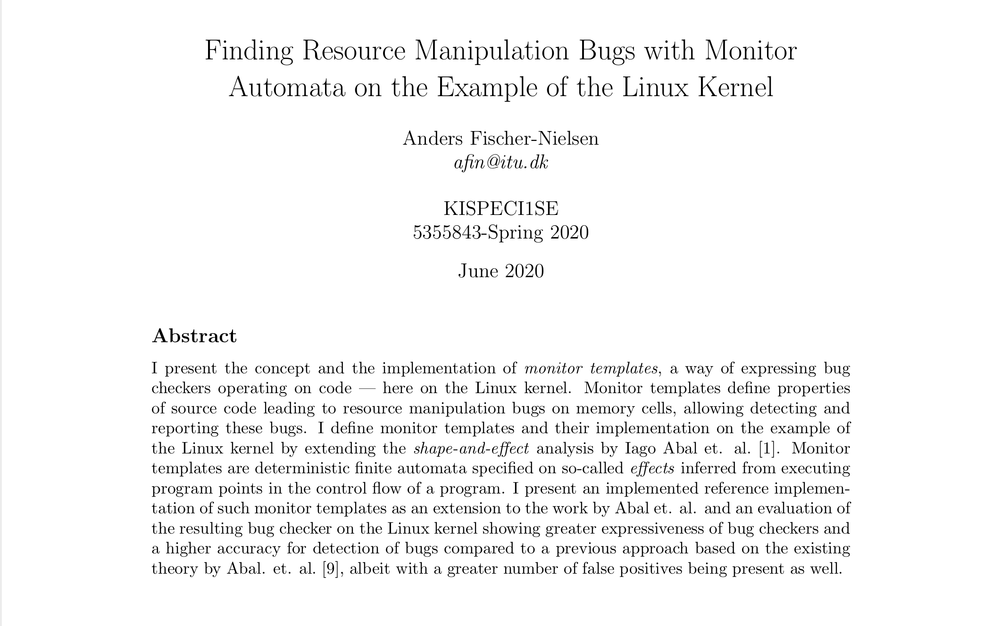

# Finding Resource Manipulation Bugs with Monitor Automata on the Example of the Linux Kernel

_The implementation of this thesis can be found at [itu-square/eba-development](https://github.com/itu-square/eba-development/)._

The repository my thesis at the IT University of Copenhagen.

The thesis is available as a [PDF](report.pdf) in this repository. 

