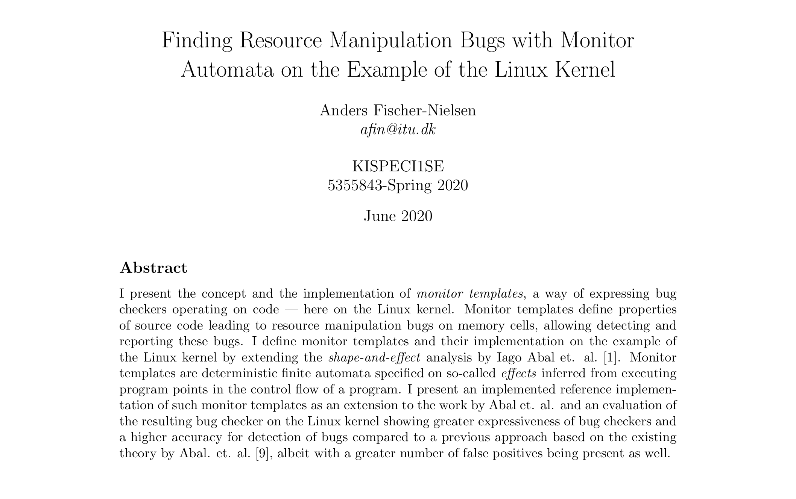

# Finding Resource Manipulation Bugs with Monitor Automata on the Example of the Linux Kernel

The repository my thesis at the IT University of Copenhagen.

The thesis is available as a [PDF](https://github.com/andersfischernielsen/Finding-Resource-Manipulation-Bugs-with-Monitor-Automata-on-the-Example-of-the-Linux-Kernel/blob/master/report.pdf) in this repository. 
